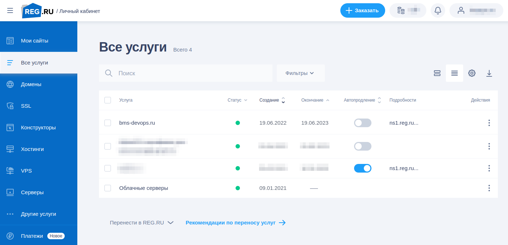
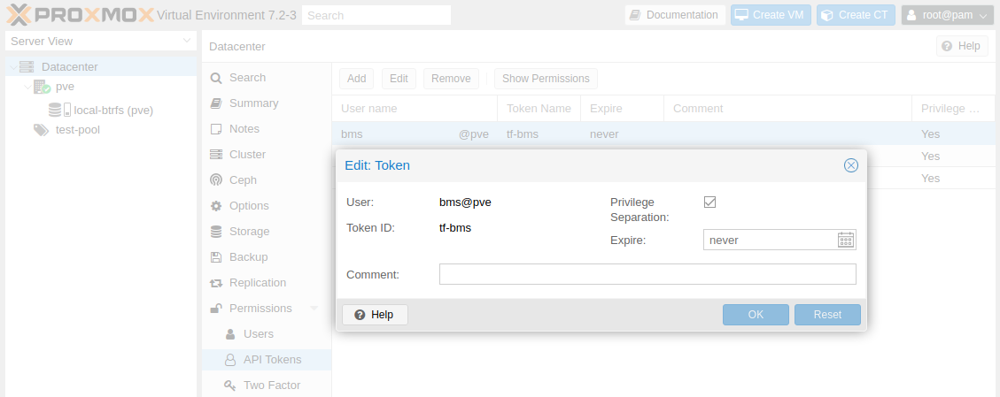
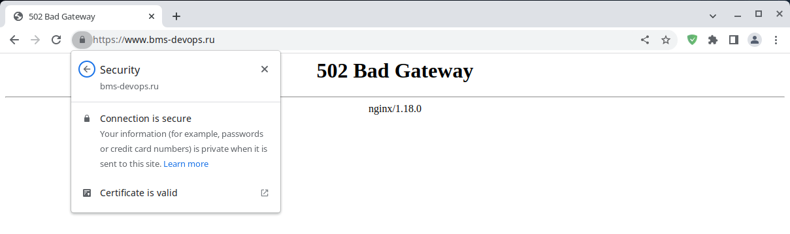

# Дипломный практикум

<details>
<summary>Цели...</summary>

- [x] 1. *Зарегистрировать доменное имя (любое на ваш выбор в любой доменной зоне).*
- [x] 2. *Подготовить инфраструктуру с помощью Terraform на базе облачного провайдера YandexCloud.*
- [x] 3. *Настроить внешний Reverse Proxy на основе Nginx и LetsEncrypt.*
- [x] 4. *Настроить кластер MySQL.*
- [ ] 5. *Установить WordPress.*
- [ ] 6. *Развернуть Gitlab CE и Gitlab Runner.*
- [ ] 7. *Настроить CI/CD для автоматического развёртывания приложения.*
- [ ] 8. *Настроить мониторинг инфраструктуры с помощью стека: Prometheus, Alert Manager и Grafana.*
</details>

### Этапы выполнения:

## 1. Регистрация доменного имени

<details>
<summary>Детали...</summary>

*Подойдет любое доменное имя на ваш выбор в любой доменной зоне.*
*ПРИМЕЧАНИЕ: Далее в качестве примера используется домен you.domain замените его вашим доменом.*

**Рекомендуемые регистраторы:**

- *nic.ru*
- *reg.ru*

**Цель:**

- [x] 1. *Получить возможность выписывать TLS сертификаты для веб-сервера.*


**Ожидаемые результаты:**

- [x] 1. *У вас есть доступ к личному кабинету на сайте регистратора.*
- [x] 2. *Вы зарезистрировали домен и можете им управлять (редактировать dns записи в рамках этого домена).*
---
</details>

## Решение:

Доступ к личному кабинету с зарегистрированным доменом `bms-devops.ru`


---


## 2. Создание инфраструктуры

<details>
<summary>Детали...</summary>

*Для начала необходимо подготовить инфраструктуру в YC при помощи Terraform.*

**Особенности выполнения:**

- *Бюджет купона ограничен, что следует иметь в виду при проектировании инфраструктуры и использовании ресурсов;*
- *Следует использовать последнюю стабильную версию Terraform.*

**Предварительная подготовка:**

- [x] 1. *Создайте сервисный аккаунт, который будет в дальнейшем использоваться Terraform для работы с инфраструктурой с необходимыми и достаточными правами. Не стоит использовать права суперпользователя*
- [x] 2. *Подготовьте backend для Terraform:*
    - [ ] а. *Рекомендуемый вариант: Terraform Cloud*
    - [ ] б. *Альтернативный вариант: S3 bucket в созданном YC аккаунте.*
    - [x] в. *Использовался собственный backend на MinIO*
- [x] 3. *Настройте workspaces*
    - [ ] а. *Рекомендуемый вариант: создайте два workspace: stage и prod. В случае выбора этого варианта все последующие шаги должны учитывать факт существования нескольких workspace.*
    - [x] б. *Альтернативный вариант: используйте один workspace, назвав его stage. Пожалуйста, не используйте workspace, создаваемый Terraform-ом по-умолчанию (default).*
- [ ] 4. *Создайте VPC с подсетями в разных зонах доступности.*
- [x] 5. *Убедитесь, что теперь вы можете выполнить команды terraform destroy и terraform apply без дополнительных ручных действий.*
- [ ] 6. *В случае использования Terraform Cloud в качестве backend убедитесь, что применение изменений успешно проходит, используя web-интерфейс Terraform cloud.*

**Цель:**

- [x] 1. *Повсеместно применять IaaC подход при организации (эксплуатации) инфраструктуры.*
- [x] 2. *Иметь возможность быстро создавать (а также удалять) виртуальные машины и сети. С целью экономии денег на вашем аккаунте в YandexCloud.*

**Ожидаемые результаты:**

- [x] 1. *Terraform сконфигурирован и создание инфраструктуры посредством Terraform возможно без дополнительных ручных действий.*
- [x] 2. *Полученная конфигурация инфраструктуры является предварительной, поэтому в ходе дальнейшего выполнения задания возможны изменения.*
---
</details>

## Решение:

[Сценарий развертывания инфраструктуры Terraform ](https://github.com/badanin/netology-diplom/tree/master/terraform/lxc)  
[S3 bucket для Terraform](https://github.com/badanin/netology-diplom/tree/master/terraform/s3)  

1. Сервисный аккаунт для `pve`:
``` bash
pveum user add test@pve
pveum group add test-gr@pve
pveum acl modify / -group test-gr -role PVEVMAdmin
pveum user modify test@pve -group test-gr
pveum acl modify / -token 'test@pve!tf-test' -role PVEVMAdmin
```
```
┌──────────────┬──────────────────────────────────────┐
│ key          │ value                                │
╞══════════════╪══════════════════════════════════════╡
│ full-tokenid │ test@pve!tf-test                     │
├──────────────┼──────────────────────────────────────┤
│ info         │ {"privsep":"1"}                      │
├──────────────┼──────────────────────────────────────┤
│ value        │ 30eb9d36-8a60-4987-801c-bd94880f26a6 │
└──────────────┴──────────────────────────────────────┘
```


2. backend поднян на MinIO:
```yml
terraform {
  backend "s3" {
    bucket = "tfstate"
    key    = "terraform.tfstate"
    region = "us-east-1"
    access_key = "access_key"
    secret_key = "secret_key"
    endpoint = "http://bms-devops.ru:9000"
    skip_credentials_validation = true
    force_path_style = true
  }
}
```
> добавить автоматизацию создания сервисного аккаунта в `MinIO`
3. Создан `workspaces` для проекта
`terraform workspace new stage`
4. Одна `VPC` подсеть для всех виртуальных машин
> можно попробовать автоматизировать создание сетевых интерфейсов через ansible
5. Витруальные машины разворачиваются и удаляются по `terraform apply/destroy`

---


## 3. Установка Nginx и LetsEncrypt

<details>
<summary>Детали...</summary>

*Необходимо разработать Ansible роль для установки Nginx и LetsEncrypt.*
*Для получения LetsEncrypt сертификатов во время тестов своего кода пользуйтесь тестовыми сертификатами, так как количество запросов к боевым серверам LetsEncrypt лимитировано.*

**Рекомендации:**

- *Имя сервера: you.domain*
- *Характеристики: 2vCPU, 2 RAM, External address (Public) и Internal address.*

Цель:

- [x] 1. *Создать reverse proxy с поддержкой TLS для обеспечения безопасного доступа к веб-сервисам по HTTPS.*

**Ожидаемые результаты:**

- [x] 1. *В вашей доменной зоне настроены все A-записи на внешний адрес этого сервера:*
    - *https://www.you.domain (WordPress)*
    - *https://gitlab.you.domain (Gitlab)*
    - *https://grafana.you.domain (Grafana)*
    - *https://prometheus.you.domain (Prometheus)*
    - *https://alertmanager.you.domain (Alert Manager)*
- [x] 2. *Настроены все upstream для выше указанных URL, куда они сейчас ведут на этом шаге не важно, позже вы их отредактируете и укажите верные значения.*
- [x] 3. *В браузере можно открыть любой из этих URL и увидеть ответ сервера (502 Bad Gateway). На текущем этапе выполнение задания это нормально!*
---
</details>

## Решение:

1. Доменные имена зарегистрированы:

`dig @8.8.8.8 {www,gitlab,grafana,prometheus,alertmanager}.bms-devops.ru +short`

```text
bms-devops.ru.
94.142.140.241
bms-devops.ru.
94.142.140.241
bms-devops.ru.
94.142.140.241
bms-devops.ru.
94.142.140.241
bms-devops.ru.
94.142.140.241
```

3. Настроены все необходимые `proxy_pass` на хосты:

`ls -1 /etc/nginx/sites-enabled/`

```text
alertmanager.bms-devops.ru.conf
default
gitlab.bms-devops.ru.conf
grafana.bms-devops.ru.conf
prometheus.bms-devops.ru.conf
www.bms-devops.ru.conf
```

4. Сертификаты на страницах валидные, выпускаются по команде:

`certbot -c /etc/letsencrypt/cli.ini`



---


## 4. Установка кластера MySQL

<details>
<summary>Детали...</summary>

*Необходимо разработать Ansible роль для установки кластера MySQL.*

**Рекомендации:**

- *Имена серверов: db01.you.domain и db02.you.domain*
- *Характеристики: 4vCPU, 4 RAM, Internal address.*

**Цель:**

- [x] *Получить отказоустойчивый кластер баз данных MySQL.*

*Вы должны понимать, что в рамках обучения это допустимые значения, но в боевой среде использование подобных значений не приемлимо! Считается хорошей практикой использовать логины и пароли повышенного уровня сложности. В которых будут содержаться буквы верхнего и нижнего регистров, цифры, а также специальные символы!*

**Ожидаемые результаты:**

- [x] 1. *MySQL работает в режиме репликации Master/Slave.*
- [x] 2. *В кластере автоматически создаётся база данных c именем wordpress.*
- [x] 3. *В кластере автоматически создаётся пользователь wordpress с полными правами на базу wordpress и паролем wordpress.*
---
</details>

## Решение:

1. На серверы `db1` и `db2` устанавливается `MariaDB` и настраивается репликация `Master`/`Slave`:

```text
MariaDB [(none)]> SHOW SLAVE STATUS \G;
*************************** 1. row ***************************
                Slave_IO_State: Waiting for master to send event
                   Master_Host: db1
                   Master_User: replication
                   Master_Port: 3306
                 Connect_Retry: 60
               Master_Log_File: mysql-bin.000001
           Read_Master_Log_Pos: 1456
                Relay_Log_File: mysql-relay-bin.000003
                 Relay_Log_Pos: 1755
         Relay_Master_Log_File: mysql-bin.000001
              Slave_IO_Running: Yes
             Slave_SQL_Running: Yes
```

2. В кластере автоматически создается база данных для `wordpress`:

`MariaDB [(none)]> SHOW DATABASES;`

```text
+--------------------+
| Database           |
+--------------------+
| information_schema |
| mysql              |
| performance_schema |
| wordpress          |
+--------------------+
```

3. Создается пользователь `wordpress` с полными правами на базу данных `wordpress`:

`MariaDB [wordpress]> SHOW GRANTS;`

```text
+-------------------------------------------------------------------------------------------------------------------+
| Grants for wordpress@172.16.0.%                                                                                   |
+-------------------------------------------------------------------------------------------------------------------+
| GRANT USAGE ON *.* TO `wordpress`@`172.16.0.%` IDENTIFIED BY PASSWORD '*C260A4F79FA905AF65142FFE0B9A14FE0E1519CC' |
| GRANT ALL PRIVILEGES ON `wordpress`.`localhost` TO `wordpress`@`172.16.0.%`                                       |
+-------------------------------------------------------------------------------------------------------------------+
```

---


## 5. Установка WordPress
<details>
<summary>Детали...</summary>

*Необходимо разработать Ansible роль для установки WordPress.*

**Рекомендации:**

- *Имя сервера: app.you.domain*
- *Характеристики: 4vCPU, 4 RAM, Internal address.*

**Цель:**

- [ ] *Установить WordPress. Это система управления содержимым сайта (CMS) с открытым исходным кодом.*

*По данным W3techs, WordPress используют 64,7% всех веб-сайтов, которые сделаны на CMS. Это 41,1% всех существующих в мире сайтов. Эту платформу для своих блогов используют The New York Times и Forbes. Такую популярность WordPress получил за удобство интерфейса и большие возможности.*

**Ожидаемые результаты:**

- [ ] 1. *Виртуальная машина на которой установлен WordPress и Nginx/Apache (на ваше усмотрение).*
- [ ] 2. *В вашей доменной зоне настроена A-запись на внешний адрес reverse proxy:*
    - *https://www.you.domain (WordPress)*
- [ ] 3. *На сервере you.domain отредактирован upstream для выше указанного URL и он смотрит на виртуальную машину на которой установлен WordPress.*
- [ ] 4. *В браузере можно открыть URL https://www.you.domain и увидеть главную страницу WordPress.*
---
</details>

## Решение:

---


## 6. Установка Gitlab CE и Gitlab Runner

<details>
<summary>Детали...</summary>

*Необходимо настроить CI/CD систему для автоматического развертывания приложения при изменении кода.*

**Рекомендации:**

- *Имена серверов: gitlab.you.domain и runner.you.domain*
- *Характеристики: 4vCPU, 4 RAM, Internal address.*

**Цель:**

- [ ] 1. *Построить pipeline доставки кода в среду эксплуатации, то есть настроить автоматический деплой на сервер app.you.domain при коммите в репозиторий с WordPress. Подробнее о Gitlab CI*

**Ожидаемый результат:**

- [ ] 1. *Интерфейс Gitlab доступен по https.*
- [ ] 2. *В вашей доменной зоне настроена A-запись на внешний адрес reverse proxy:*
    - *https://gitlab.you.domain (Gitlab)*
- [ ] 3. *На сервере you.domain отредактирован upstream для выше указанного URL и он смотрит на виртуальную машину на которой установлен Gitlab.*
- [ ] 4. *При любом коммите в репозиторий с WordPress и создании тега (например, v1.0.0) происходит деплой на виртуальную машину.*
---
</details>

## Решение:

---


## 7. Установка Prometheus, Alert Manager, Node Exporter и Grafana
<details>
<summary>Детали...</summary>

*Необходимо разработать Ansible роль для установки Prometheus, Alert Manager и Grafana.*

**Рекомендации:**

- *Имя сервера: monitoring.you.domain*
- *Характеристики: 4vCPU, 4 RAM, Internal address.*

**Цель:**

- [ ] 1. *Получение метрик со всей инфраструктуры.*

*Примечание: дашборды со звёздочкой являются опциональными заданиями повышенной сложности их выполнение желательно, но не обязательно.*

**Ожидаемые результаты:**

- [ ] 1. *Интерфейсы Prometheus, Alert Manager и Grafana доступены по https.*
- [ ] 2. *В вашей доменной зоне настроены A-записи на внешний адрес reverse proxy:*
    - *https://grafana.you.domain (Grafana)*
    - *https://prometheus.you.domain (Prometheus)*
    - *https://alertmanager.you.domain (Alert Manager)*
- [ ] 3. *На сервере you.domain отредактированы upstreams для выше указанных URL и они смотрят на виртуальную машину на которой установлены Prometheus, Alert Manager и Grafana.*
- [ ] 4. *На всех серверах установлен Node Exporter и его метрики доступны Prometheu*s.
- [ ] 5. *У Alert Manager есть необходимый набор правил для создания алертов.*
- [ ] 6. *В Grafana есть дашборд отображающий метрики из Node Exporter по всем серверам.*
- [ ] 7. *В Grafana есть дашборд отображающий метрики из MySQL (*).*
- [ ] 8. *В Grafana есть дашборд отображающий метрики из WordPress (*).*
---
</details>

## Решение:

---


## Что необходимо для сдачи задания?

<details>
<summary>Детали...</summary>

- [ ] 1. *Репозиторий со всеми Terraform манифестами и готовность продемонстрировать создание всех ресурсов с нуля.*
- [ ] 2. *Репозиторий со всеми Ansible ролями и готовность продемонстрировать установку всех сервисов с нуля.*
- [ ] 3. *Скриншоты веб-интерфейсов всех сервисов работающих по HTTPS на вашем доменном имени.*
    - *https://www.you.domain (WordPress)*
    - *https://gitlab.you.domain (Gitlab)*
    - *https://grafana.you.domain (Grafana)*
    - *https://prometheus.you.domain (Prometheus)*
    - *https://alertmanager.you.domain (Alert Manager)*
- [ ] 5. *Все репозитории рекомендуется хранить на одном из ресурсов (github.com или gitlab.com).*

</details>
