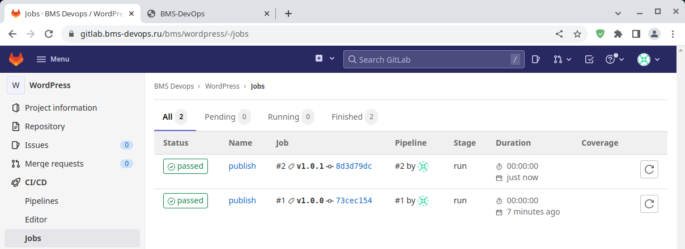

# Дипломный практикум

<details>
<summary>Цели...</summary>

- [x] 1. *Зарегистрировать доменное имя (любое на ваш выбор в любой доменной зоне).*
- [x] 2. *Подготовить инфраструктуру с помощью Terraform на базе облачного провайдера YandexCloud.*
- [x] 3. *Настроить внешний Reverse Proxy на основе Nginx и LetsEncrypt.*
- [x] 4. *Настроить кластер MySQL.*
- [x] 5. *Установить WordPress.*
- [x] 6. *Развернуть Gitlab CE и Gitlab Runner.*
- [x] 7. *Настроить CI/CD для автоматического развёртывания приложения.*
- [x] 8. *Настроить мониторинг инфраструктуры с помощью стека: Prometheus, Alert Manager и Grafana.*
</details>

# Общее описание

1. В качестве "Облачного сервиса" был взят сервер с установленным `Proxmox`, доступ к которому был организован через арендованный `VPS` с прямым внешним `IP`.

<details>
<summary>Схема...</summary>


</details>

---

2. В качестве хранилища состояний `terraform` был развернут `MinIO S3` сервис.

[terraform - s3](https://github.com/badanin/netology-diplom/tree/master/terraform/s3)  

[ansible - s3](https://github.com/badanin/netology-diplom/tree/master/ansible/s3)

<details>
<summary>Схема...</summary>


</details>

---

3. С помощью сценария `terraform` развернуто 6-ть `LXC` контейнера, на которые передается открытые ключи `ssh` для организации удаленного доступа

[terraform - lxc](https://github.com/badanin/netology-diplom/tree/master/terraform/lxc)

<details>
<summary>Схема...</summary>


</details>

---

4. При запуске плейбука `ansible`, первым этупом производится предварительная настройка всех хостов. Пополняются файлы `/etc/hosts`, для обеспечения коммуникации между хостами по именам. Производится генерация `ssh`-ключей и их обмен между хостами.

[ansible - playbook](https://github.com/badanin/netology-diplom/tree/master/ansible/lxc)

<details>
<summary>Схема...</summary>


</details>

---

5. Роль `nginx` производится установки службы, выпуск валидный сертификатов через `certbot` и генерацию файлов конфигурации для всех публичных хостов. Данный хост выступает в качестве `jump-host`, для доступа к остальным.

[ansible - nginx](https://github.com/badanin/netology-diplom/tree/master/ansible/lxc/roles/nginx)

<details>
<summary>Схема...</summary>


</details>

---

6. На двух хостах разворачивается кластер `mariadb` по схеме `master/slave`. Создается база данных для `wordpress`.

[ansible - db](https://github.com/badanin/netology-diplom/tree/master/ansible/lxc/roles/db)

<details>
<summary>Схема...</summary>


</details>

---

7. Производится установка `apache2` сервера с `php7.4`, на который загружается и разворачивается `wordpress` в базу данных из прошлого шага.

[ansible - wordpress](https://github.com/badanin/netology-diplom/tree/master/ansible/lxc/roles/www)

<details>
<summary>Схема...</summary>


</details>

---

8. Устанавливается `gitlab` и `gitlab-runner`. Создается `pipeline`, который публикует страницы из репозитория в `wordpress` через `ssh`.

[ansible - gitlab](https://github.com/badanin/netology-diplom/tree/master/ansible/lxc/roles/gitlab)  

[ansible - gitlab-runner](https://github.com/badanin/netology-diplom/tree/master/ansible/lxc/roles/gitlab-runner)

<details>
<summary>Схема...</summary>


</details>

---

9. На хосте запускается 3-службы в `docker`-контейнерах. `prometheus` - обеспечивает сбор информации с хостов и генерацию алертов, `grafana` - обеспечивается визуализацию метрик, `alertmanager` - производит оповещение.

[ansible - monitoring](https://github.com/badanin/netology-diplom/tree/master/ansible/lxc/roles/monitoring)

<details>
<summary>Схема...</summary>


</details>

---

10. На все хосты устанавливаются `node_exporter`, которые генерируются метрики для `prometheus`.

[ansible - node_exporter](https://github.com/badanin/netology-diplom/tree/master/ansible/lxc/roles/node_exporter)

<details>
<summary>Схема...</summary>


</details>

---

## Общая схема:


<details>
<summary>terraform apply</summary>

```text
Terraform used the selected providers to generate the following execution plan. Resource actions are indicated with the following symbols:
  + create

Terraform will perform the following actions:

  # module.db1.proxmox_lxc.lxc_containers will be created
  + resource "proxmox_lxc" "lxc_containers" {
      + arch            = "amd64"
      + cmode           = "tty"
      + console         = true
      + cores           = 1
      + cpulimit        = 0
      + cpuunits        = 1024
      + hostname        = "db1.bms-devops.ru"
      + id              = (known after apply)
      + memory          = 512
      + nameserver      = "172.16.0.11"
      + onboot          = true
      + ostemplate      = "local-btrfs:vztmpl/debian-11-standard_11.3-1_amd64.tar.zst"
      + ostype          = (known after apply)
      + password        = (sensitive value)
      + protection      = false
      + searchdomain    = "bms-devops.ru"
      + ssh_public_keys = (sensitive)
      + start           = true
      + swap            = 0
      + target_node     = "pve"
      + tty             = 2
      + unprivileged    = true
      + unused          = (known after apply)
      + vmid            = 102

      + features {
          + fuse    = false
          + keyctl  = false
          + mknod   = false
          + nesting = true
        }

      + network {
          + bridge = "vmbr0"
          + gw     = "172.16.0.11"
          + hwaddr = (known after apply)
          + ip     = "172.16.0.102/24"
          + name   = "eth0"
          + tag    = (known after apply)
          + trunks = (known after apply)
          + type   = (known after apply)
        }

      + rootfs {
          + size    = "2G"
          + storage = "local-btrfs"
          + volume  = (known after apply)
        }
    }

  # module.db2.proxmox_lxc.lxc_containers will be created
  + resource "proxmox_lxc" "lxc_containers" {
      + arch            = "amd64"
      + cmode           = "tty"
      + console         = true
      + cores           = 1
      + cpulimit        = 0
      + cpuunits        = 1024
      + hostname        = "db2.bms-devops.ru"
      + id              = (known after apply)
      + memory          = 512
      + nameserver      = "172.16.0.11"
      + onboot          = true
      + ostemplate      = "local-btrfs:vztmpl/debian-11-standard_11.3-1_amd64.tar.zst"
      + ostype          = (known after apply)
      + password        = (sensitive value)
      + protection      = false
      + searchdomain    = "bms-devops.ru"
      + ssh_public_keys = (sensitive)
      + start           = true
      + swap            = 0
      + target_node     = "pve"
      + tty             = 2
      + unprivileged    = true
      + unused          = (known after apply)
      + vmid            = 103

      + features {
          + fuse    = false
          + keyctl  = false
          + mknod   = false
          + nesting = true
        }

      + network {
          + bridge = "vmbr0"
          + gw     = "172.16.0.11"
          + hwaddr = (known after apply)
          + ip     = "172.16.0.103/24"
          + name   = "eth0"
          + tag    = (known after apply)
          + trunks = (known after apply)
          + type   = (known after apply)
        }

      + rootfs {
          + size    = "2G"
          + storage = "local-btrfs"
          + volume  = (known after apply)
        }
    }

  # module.gitlab.proxmox_lxc.lxc_containers will be created
  + resource "proxmox_lxc" "lxc_containers" {
      + arch            = "amd64"
      + cmode           = "tty"
      + console         = true
      + cores           = 4
      + cpulimit        = 0
      + cpuunits        = 1024
      + hostname        = "gitlab.bms-devops.ru"
      + id              = (known after apply)
      + memory          = 5120
      + nameserver      = "172.16.0.11"
      + onboot          = true
      + ostemplate      = "local-btrfs:vztmpl/debian-11-standard_11.3-1_amd64.tar.zst"
      + ostype          = (known after apply)
      + password        = (sensitive value)
      + protection      = false
      + searchdomain    = "bms-devops.ru"
      + ssh_public_keys = (sensitive)
      + start           = true
      + swap            = 0
      + target_node     = "pve"
      + tty             = 2
      + unprivileged    = true
      + unused          = (known after apply)
      + vmid            = 104

      + features {
          + fuse    = false
          + keyctl  = false
          + mknod   = false
          + nesting = true
        }

      + network {
          + bridge = "vmbr0"
          + gw     = "172.16.0.11"
          + hwaddr = (known after apply)
          + ip     = "172.16.0.104/24"
          + name   = "eth0"
          + tag    = (known after apply)
          + trunks = (known after apply)
          + type   = (known after apply)
        }

      + rootfs {
          + size    = "8G"
          + storage = "local-btrfs"
          + volume  = (known after apply)
        }
    }

  # module.mon.proxmox_lxc.lxc_containers will be created
  + resource "proxmox_lxc" "lxc_containers" {
      + arch            = "amd64"
      + cmode           = "tty"
      + console         = true
      + cores           = 1
      + cpulimit        = 0
      + cpuunits        = 1024
      + hostname        = "mon.bms-devops.ru"
      + id              = (known after apply)
      + memory          = 512
      + nameserver      = "172.16.0.11"
      + onboot          = true
      + ostemplate      = "local-btrfs:vztmpl/debian-11-standard_11.3-1_amd64.tar.zst"
      + ostype          = (known after apply)
      + password        = (sensitive value)
      + protection      = false
      + searchdomain    = "bms-devops.ru"
      + ssh_public_keys = (sensitive)
      + start           = true
      + swap            = 0
      + target_node     = "pve"
      + tty             = 2
      + unprivileged    = true
      + unused          = (known after apply)
      + vmid            = 105

      + features {
          + fuse    = false
          + keyctl  = false
          + mknod   = false
          + nesting = true
        }

      + network {
          + bridge = "vmbr0"
          + gw     = "172.16.0.11"
          + hwaddr = (known after apply)
          + ip     = "172.16.0.105/24"
          + name   = "eth0"
          + tag    = (known after apply)
          + trunks = (known after apply)
          + type   = (known after apply)
        }

      + rootfs {
          + size    = "2G"
          + storage = "local-btrfs"
          + volume  = (known after apply)
        }
    }

  # module.nginx.proxmox_lxc.lxc_containers will be created
  + resource "proxmox_lxc" "lxc_containers" {
      + arch            = "amd64"
      + cmode           = "tty"
      + console         = true
      + cores           = 1
      + cpulimit        = 0
      + cpuunits        = 1024
      + hostname        = "nginx.bms-devops.ru"
      + id              = (known after apply)
      + memory          = 512
      + nameserver      = "172.16.0.11"
      + onboot          = true
      + ostemplate      = "local-btrfs:vztmpl/debian-11-standard_11.3-1_amd64.tar.zst"
      + ostype          = (known after apply)
      + password        = (sensitive value)
      + protection      = false
      + searchdomain    = "bms-devops.ru"
      + ssh_public_keys = (sensitive)
      + start           = true
      + swap            = 0
      + target_node     = "pve"
      + tty             = 2
      + unprivileged    = true
      + unused          = (known after apply)
      + vmid            = 100

      + features {
          + fuse    = false
          + keyctl  = false
          + mknod   = false
          + nesting = true
        }

      + network {
          + bridge = "vmbr0"
          + gw     = "172.16.0.11"
          + hwaddr = (known after apply)
          + ip     = "172.16.0.100/24"
          + name   = "eth0"
          + tag    = (known after apply)
          + trunks = (known after apply)
          + type   = (known after apply)
        }

      + rootfs {
          + size    = "2G"
          + storage = "local-btrfs"
          + volume  = (known after apply)
        }
    }

  # module.www.proxmox_lxc.lxc_containers will be created
  + resource "proxmox_lxc" "lxc_containers" {
      + arch            = "amd64"
      + cmode           = "tty"
      + console         = true
      + cores           = 1
      + cpulimit        = 0
      + cpuunits        = 1024
      + hostname        = "www.bms-devops.ru"
      + id              = (known after apply)
      + memory          = 512
      + nameserver      = "172.16.0.11"
      + onboot          = true
      + ostemplate      = "local-btrfs:vztmpl/debian-11-standard_11.3-1_amd64.tar.zst"
      + ostype          = (known after apply)
      + password        = (sensitive value)
      + protection      = false
      + searchdomain    = "bms-devops.ru"
      + ssh_public_keys = (sensitive)
      + start           = true
      + swap            = 0
      + target_node     = "pve"
      + tty             = 2
      + unprivileged    = true
      + unused          = (known after apply)
      + vmid            = 101

      + features {
          + fuse    = false
          + keyctl  = false
          + mknod   = false
          + nesting = true
        }

      + network {
          + bridge = "vmbr0"
          + gw     = "172.16.0.11"
          + hwaddr = (known after apply)
          + ip     = "172.16.0.101/24"
          + name   = "eth0"
          + tag    = (known after apply)
          + trunks = (known after apply)
          + type   = (known after apply)
        }

      + rootfs {
          + size    = "2G"
          + storage = "local-btrfs"
          + volume  = (known after apply)
        }
    }

Plan: 6 to add, 0 to change, 0 to destroy.

Do you want to perform these actions in workspace "stage"?
  Terraform will perform the actions described above.
  Only 'yes' will be accepted to approve.

  Enter a value: yes

module.db2.proxmox_lxc.lxc_containers: Creating...
module.gitlab.proxmox_lxc.lxc_containers: Creating...
module.mon.proxmox_lxc.lxc_containers: Creating...
module.www.proxmox_lxc.lxc_containers: Creating...
module.db1.proxmox_lxc.lxc_containers: Creating...
module.nginx.proxmox_lxc.lxc_containers: Creating...
module.mon.proxmox_lxc.lxc_containers: Still creating... [10s elapsed]
module.gitlab.proxmox_lxc.lxc_containers: Still creating... [10s elapsed]
module.db2.proxmox_lxc.lxc_containers: Still creating... [10s elapsed]
module.nginx.proxmox_lxc.lxc_containers: Still creating... [10s elapsed]
module.www.proxmox_lxc.lxc_containers: Still creating... [10s elapsed]
module.db1.proxmox_lxc.lxc_containers: Still creating... [10s elapsed]
module.mon.proxmox_lxc.lxc_containers: Still creating... [20s elapsed]
module.db2.proxmox_lxc.lxc_containers: Still creating... [20s elapsed]
module.gitlab.proxmox_lxc.lxc_containers: Still creating... [20s elapsed]
module.www.proxmox_lxc.lxc_containers: Still creating... [20s elapsed]
module.nginx.proxmox_lxc.lxc_containers: Still creating... [20s elapsed]
module.db1.proxmox_lxc.lxc_containers: Still creating... [20s elapsed]
module.www.proxmox_lxc.lxc_containers: Creation complete after 23s [id=pve/lxc/101]
module.gitlab.proxmox_lxc.lxc_containers: Creation complete after 23s [id=pve/lxc/104]
module.db1.proxmox_lxc.lxc_containers: Creation complete after 23s [id=pve/lxc/102]
module.db2.proxmox_lxc.lxc_containers: Creation complete after 23s [id=pve/lxc/103]
module.mon.proxmox_lxc.lxc_containers: Still creating... [30s elapsed]
module.nginx.proxmox_lxc.lxc_containers: Still creating... [30s elapsed]
module.nginx.proxmox_lxc.lxc_containers: Creation complete after 35s [id=pve/lxc/100]
module.mon.proxmox_lxc.lxc_containers: Creation complete after 35s [id=pve/lxc/105]

Apply complete! Resources: 6 added, 0 changed, 0 destroyed.
```
</details>


<details>
<summary>ansible-playbook -i inventory site.yml</summary>

```text
PLAY [configure ssh and hosts file] ******************************************************************************************

TASK [Gathering Facts] *******************************************************************************************************
ok: [nginx]
ok: [gitlab]
ok: [db2]
ok: [www]
ok: [db1]
ok: [mon]

TASK [update hosts files] ****************************************************************************************************
changed: [nginx] => (item=nginx)
changed: [db2] => (item=nginx)
changed: [www] => (item=nginx)
changed: [db1] => (item=nginx)
changed: [gitlab] => (item=nginx)
changed: [nginx] => (item=www)
changed: [db2] => (item=www)
changed: [gitlab] => (item=www)
changed: [www] => (item=www)
changed: [nginx] => (item=db1)
changed: [db1] => (item=www)
changed: [nginx] => (item=db2)
changed: [www] => (item=db1)
changed: [db2] => (item=db1)
changed: [gitlab] => (item=db1)
changed: [db1] => (item=db1)
changed: [nginx] => (item=gitlab)
changed: [db2] => (item=db2)
changed: [www] => (item=db2)
changed: [gitlab] => (item=db2)
changed: [db1] => (item=db2)
changed: [nginx] => (item=mon)
changed: [gitlab] => (item=gitlab)
changed: [db2] => (item=gitlab)
changed: [db1] => (item=gitlab)
changed: [www] => (item=gitlab)
changed: [mon] => (item=nginx)
changed: [gitlab] => (item=mon)
changed: [db2] => (item=mon)
changed: [www] => (item=mon)
changed: [db1] => (item=mon)
changed: [mon] => (item=www)
changed: [mon] => (item=db1)
changed: [mon] => (item=db2)
changed: [mon] => (item=gitlab)
changed: [mon] => (item=mon)

TASK [config ssh] ************************************************************************************************************
changed: [nginx]
changed: [db2]
changed: [gitlab]
changed: [db1]
changed: [www]
changed: [mon]

TASK [generate ssh keypair] **************************************************************************************************
changed: [www]
changed: [nginx]
changed: [db2]
changed: [gitlab]
changed: [db1]
changed: [mon]

TASK [exchange ssh public key] ***********************************************************************************************
changed: [nginx] => (item=nginx)
changed: [gitlab] => (item=nginx)
changed: [db1] => (item=nginx)
changed: [www] => (item=nginx)
changed: [db2] => (item=nginx)
changed: [nginx] => (item=www)
changed: [nginx] => (item=db1)
changed: [db2] => (item=www)
changed: [www] => (item=www)
changed: [gitlab] => (item=www)
changed: [db1] => (item=www)
changed: [nginx] => (item=db2)
changed: [db1] => (item=db1)
changed: [db2] => (item=db1)
changed: [www] => (item=db1)
changed: [gitlab] => (item=db1)
changed: [nginx] => (item=gitlab)
changed: [www] => (item=db2)
changed: [nginx] => (item=mon)
changed: [gitlab] => (item=db2)
changed: [db2] => (item=db2)
changed: [db1] => (item=db2)
changed: [www] => (item=gitlab)
changed: [db1] => (item=gitlab)
changed: [gitlab] => (item=gitlab)
changed: [db2] => (item=gitlab)
changed: [mon] => (item=nginx)
changed: [db1] => (item=mon)
changed: [gitlab] => (item=mon)
changed: [www] => (item=mon)
changed: [db2] => (item=mon)
changed: [mon] => (item=www)
changed: [mon] => (item=db1)
changed: [mon] => (item=db2)
changed: [mon] => (item=gitlab)
changed: [mon] => (item=mon)

TASK [create dict for hostname] **********************************************************************************************
ok: [nginx] => (item=nginx)
ok: [nginx] => (item=www)
ok: [nginx] => (item=db1)
ok: [nginx] => (item=db2)
ok: [nginx] => (item=gitlab)
ok: [nginx] => (item=mon)
ok: [www] => (item=nginx)
ok: [www] => (item=www)
ok: [www] => (item=db1)
ok: [www] => (item=db2)
ok: [www] => (item=gitlab)
ok: [www] => (item=mon)
ok: [db1] => (item=nginx)
ok: [db1] => (item=www)
ok: [db1] => (item=db1)
ok: [db1] => (item=db2)
ok: [db1] => (item=gitlab)
ok: [db1] => (item=mon)
ok: [db2] => (item=nginx)
ok: [db2] => (item=www)
ok: [db2] => (item=db1)
ok: [db2] => (item=db2)
ok: [db2] => (item=gitlab)
ok: [db2] => (item=mon)
ok: [gitlab] => (item=nginx)
ok: [gitlab] => (item=www)
ok: [gitlab] => (item=db1)
ok: [gitlab] => (item=db2)
ok: [gitlab] => (item=gitlab)
ok: [gitlab] => (item=mon)
ok: [mon] => (item=nginx)
ok: [mon] => (item=www)
ok: [mon] => (item=db1)
ok: [mon] => (item=db2)
ok: [mon] => (item=gitlab)
ok: [mon] => (item=mon)

PLAY [install nginx] *********************************************************************************************************

TASK [nginx : install nginx] *************************************************************************************************
changed: [nginx]

TASK [nginx : create certbot config] *****************************************************************************************
changed: [nginx]

TASK [nginx : get certbot certificates] **************************************************************************************
changed: [nginx]

TASK [nginx : create nginx configs] ******************************************************************************************
changed: [nginx] => (item={'key': 'www', 'value': {'server': 'www', 'port': '80'}})
changed: [nginx] => (item={'key': 'gitlab', 'value': {'server': 'gitlab', 'port': '80'}})
changed: [nginx] => (item={'key': 'grafana', 'value': {'server': 'mon', 'port': '3000'}})
changed: [nginx] => (item={'key': 'prometheus', 'value': {'server': 'mon', 'port': '9090'}})
changed: [nginx] => (item={'key': 'alertmanager', 'value': {'server': 'mon', 'port': '9093'}})

TASK [nginx : enable nginx site] *********************************************************************************************
changed: [nginx] => (item={'key': 'www', 'value': {'server': 'www', 'port': '80'}})
changed: [nginx] => (item={'key': 'gitlab', 'value': {'server': 'gitlab', 'port': '80'}})
changed: [nginx] => (item={'key': 'grafana', 'value': {'server': 'mon', 'port': '3000'}})
changed: [nginx] => (item={'key': 'prometheus', 'value': {'server': 'mon', 'port': '9090'}})
changed: [nginx] => (item={'key': 'alertmanager', 'value': {'server': 'mon', 'port': '9093'}})

RUNNING HANDLER [nginx : restart nginx] **************************************************************************************
changed: [nginx]

PLAY [install db] ************************************************************************************************************

TASK [db : install mariadb] **************************************************************************************************
changed: [db2]
changed: [db1]

TASK [db : configure mariadb] ************************************************************************************************
changed: [db2]
changed: [db1]

RUNNING HANDLER [db : restart mariadb] ***************************************************************************************
changed: [db1]
changed: [db2]

TASK [db : create replication user] ******************************************************************************************
skipping: [db2]
changed: [db1]

TASK [db : check replica] ****************************************************************************************************
skipping: [db1]
ok: [db2]

TASK [db : change primary] ***************************************************************************************************
skipping: [db1]
changed: [db2]

TASK [db : create database] **************************************************************************************************
skipping: [db2]
changed: [db1]

TASK [db : create user] ******************************************************************************************************
skipping: [db2] => (item=172.16.0.%) 
skipping: [db2] => (item=www.bms-devops.ru) 
skipping: [db2] => (item=localhost) 
changed: [db1] => (item=172.16.0.%)
changed: [db1] => (item=www.bms-devops.ru)
changed: [db1] => (item=localhost)

RUNNING HANDLER [db : restart mariadb] ***************************************************************************************
changed: [db2]

PLAY [install www] ***********************************************************************************************************

TASK [www : install php] *****************************************************************************************************
changed: [www]

TASK [www : get wordpress] ***************************************************************************************************
changed: [www]

TASK [www : create wordpress directory] **************************************************************************************
changed: [www]

TASK [www : extract wordpress] ***********************************************************************************************
changed: [www]

TASK [www : create wordpress config] *****************************************************************************************
changed: [www]

TASK [www : create apache config] ********************************************************************************************
changed: [www]

TASK [www : disable default site] ********************************************************************************************
changed: [www]

TASK [www : enable wordpress site] *******************************************************************************************
changed: [www]

RUNNING HANDLER [www : restart apache2] **************************************************************************************
changed: [www]

PLAY [install gitlab] ********************************************************************************************************

TASK [gitlab : install packages] *********************************************************************************************
changed: [gitlab]

TASK [gitlab : add gitlab repo key] ******************************************************************************************
changed: [gitlab]

TASK [gitlab : copy gitlab repo list] ****************************************************************************************
changed: [gitlab]

TASK [gitlab : install gitlab] ***********************************************************************************************
changed: [gitlab]

TASK [gitlab : ensure a locale exists] ***************************************************************************************
changed: [gitlab] => (item=en_US.UTF-8)
changed: [gitlab] => (item=ru_RU.UTF-8)

TASK [gitlab : change locale] ************************************************************************************************
changed: [gitlab]

TASK [gitlab : copy gitlab config] *******************************************************************************************
changed: [gitlab]

TASK [gitlab : get service facts] ********************************************************************************************
ok: [gitlab]

TASK [gitlab : reconfigure gitlab] *******************************************************************************************
changed: [gitlab]

TASK [gitlab-runner : install packages] **************************************************************************************
ok: [gitlab]

TASK [gitlab-runner : add gitlab-runner repo key] ****************************************************************************
changed: [gitlab]

TASK [gitlab-runner : copy gitlab-runner repo list] **************************************************************************
changed: [gitlab]

TASK [gitlab-runner : install gitlab-runner] *********************************************************************************
changed: [gitlab]

TASK [gitlab-runner : check gitlab-runner exist] *****************************************************************************
ok: [gitlab]

TASK [gitlab-runner : configure gitlab-runner] *******************************************************************************
changed: [gitlab]

PLAY [install monitoring] ****************************************************************************************************

TASK [monitoring : install packages] *****************************************************************************************
changed: [mon]

TASK [monitoring : add docker repo key] **************************************************************************************
changed: [mon]

TASK [monitoring : copy docker repo list] ************************************************************************************
changed: [mon]

TASK [monitoring : install docker] *******************************************************************************************
changed: [mon]

TASK [monitoring : create data directory] ************************************************************************************
changed: [mon]

TASK [monitoring : create prometheus directory] ******************************************************************************
changed: [mon] => (item=/data/prometheus/data)
changed: [mon] => (item=/data/prometheus/config)

TASK [monitoring : create grafana directory] *********************************************************************************
changed: [mon]

TASK [monitoring : create prometheus config] *********************************************************************************
changed: [mon]

TASK [monitoring : create prometheus alert] **********************************************************************************
changed: [mon]

TASK [monitoring : start prometheus container] *******************************************************************************
changed: [mon]

TASK [monitoring : start grafana container] **********************************************************************************
changed: [mon]

TASK [monitoring : start alertmanager container] *****************************************************************************
changed: [mon]

PLAY [install node_exporter] *************************************************************************************************

TASK [node_exporter : get node_exporter] *************************************************************************************
changed: [nginx]
changed: [db1]
changed: [mon]
changed: [www]
changed: [db2]

TASK [node_exporter : extract node_exporter] *********************************************************************************
changed: [nginx]
changed: [www]
changed: [db2]
changed: [db1]
changed: [mon]

TASK [node_exporter : create node_exporter service] **************************************************************************
changed: [nginx]
changed: [mon]
changed: [db1]
changed: [db2]
changed: [www]

TASK [node_exporter : enable node_exporter service] **************************************************************************
changed: [nginx]
changed: [mon]
changed: [db1]
changed: [db2]
changed: [www]

TASK [node_exporter : start node_exporter service] ***************************************************************************
changed: [nginx]
changed: [www]
changed: [db2]
changed: [db1]
changed: [mon]

PLAY RECAP *******************************************************************************************************************
db1                        : ok=17   changed=15   unreachable=0    failed=0    skipped=2    rescued=0    ignored=0   
db2                        : ok=17   changed=14   unreachable=0    failed=0    skipped=3    rescued=0    ignored=0   
gitlab                     : ok=21   changed=16   unreachable=0    failed=0    skipped=0    rescued=0    ignored=0   
mon                        : ok=23   changed=21   unreachable=0    failed=0    skipped=0    rescued=0    ignored=0   
nginx                      : ok=17   changed=15   unreachable=0    failed=0    skipped=0    rescued=0    ignored=0   
www                        : ok=20   changed=18   unreachable=0    failed=0    skipped=0    rescued=0    ignored=0   
```

</details>


## 1. Регистрация доменного имени

<details>
<summary>Детали...</summary>

*Подойдет любое доменное имя на ваш выбор в любой доменной зоне.*
*ПРИМЕЧАНИЕ: Далее в качестве примера используется домен you.domain замените его вашим доменом.*

**Рекомендуемые регистраторы:**

- *nic.ru*
- *reg.ru*

**Цель:**

- [x] 1. *Получить возможность выписывать TLS сертификаты для веб-сервера.*


**Ожидаемые результаты:**

- [x] 1. *У вас есть доступ к личному кабинету на сайте регистратора.*
- [x] 2. *Вы зарезистрировали домен и можете им управлять (редактировать dns записи в рамках этого домена).*
---
</details>

## Решение:

Доступ к личному кабинету с зарегистрированным доменом `bms-devops.ru`


---


## 2. Создание инфраструктуры

<details>
<summary>Детали...</summary>

*Для начала необходимо подготовить инфраструктуру в YC при помощи Terraform.*

**Особенности выполнения:**

- *Бюджет купона ограничен, что следует иметь в виду при проектировании инфраструктуры и использовании ресурсов;*
- *Следует использовать последнюю стабильную версию Terraform.*

**Предварительная подготовка:**

- [x] 1. *Создайте сервисный аккаунт, который будет в дальнейшем использоваться Terraform для работы с инфраструктурой с необходимыми и достаточными правами. Не стоит использовать права суперпользователя*
- [x] 2. *Подготовьте backend для Terraform:*
    - [ ] а. *Рекомендуемый вариант: Terraform Cloud*
    - [ ] б. *Альтернативный вариант: S3 bucket в созданном YC аккаунте.*
    - [x] в. *Использовался собственный backend на MinIO*
- [x] 3. *Настройте workspaces*
    - [ ] а. *Рекомендуемый вариант: создайте два workspace: stage и prod. В случае выбора этого варианта все последующие шаги должны учитывать факт существования нескольких workspace.*
    - [x] б. *Альтернативный вариант: используйте один workspace, назвав его stage. Пожалуйста, не используйте workspace, создаваемый Terraform-ом по-умолчанию (default).*
- [ ] 4. *Создайте VPC с подсетями в разных зонах доступности.*
- [x] 5. *Убедитесь, что теперь вы можете выполнить команды terraform destroy и terraform apply без дополнительных ручных действий.*
- [ ] 6. *В случае использования Terraform Cloud в качестве backend убедитесь, что применение изменений успешно проходит, используя web-интерфейс Terraform cloud.*

**Цель:**

- [x] 1. *Повсеместно применять IaaC подход при организации (эксплуатации) инфраструктуры.*
- [x] 2. *Иметь возможность быстро создавать (а также удалять) виртуальные машины и сети. С целью экономии денег на вашем аккаунте в YandexCloud.*

**Ожидаемые результаты:**

- [x] 1. *Terraform сконфигурирован и создание инфраструктуры посредством Terraform возможно без дополнительных ручных действий.*
- [x] 2. *Полученная конфигурация инфраструктуры является предварительной, поэтому в ходе дальнейшего выполнения задания возможны изменения.*
---
</details>

## Решение:

[Сценарий развертывания инфраструктуры Terraform ](https://github.com/badanin/netology-diplom/tree/master/terraform/lxc)  
[S3 bucket для Terraform](https://github.com/badanin/netology-diplom/tree/master/terraform/s3)  

1. Сервисный аккаунт для `pve`:
``` bash
pveum user add test@pve
pveum group add test-gr@pve
pveum acl modify / -group test-gr -role PVEVMAdmin
pveum user modify test@pve -group test-gr
pveum acl modify / -token 'test@pve!tf-test' -role PVEVMAdmin
```
```
┌──────────────┬──────────────────────────────────────┐
│ key          │ value                                │
╞══════════════╪══════════════════════════════════════╡
│ full-tokenid │ test@pve!tf-test                     │
├──────────────┼──────────────────────────────────────┤
│ info         │ {"privsep":"1"}                      │
├──────────────┼──────────────────────────────────────┤
│ value        │ 30eb9d36-8a60-4987-801c-bd94880f26a6 │
└──────────────┴──────────────────────────────────────┘
```


2. backend поднян на MinIO:
```yml
terraform {
  backend "s3" {
    bucket = "tfstate"
    key    = "terraform.tfstate"
    region = "us-east-1"
    access_key = "access_key"
    secret_key = "secret_key"
    endpoint = "http://bms-devops.ru:9000"
    skip_credentials_validation = true
    force_path_style = true
  }
}
```
> добавить автоматизацию создания сервисного аккаунта в `MinIO`
3. Создан `workspaces` для проекта
`terraform workspace new stage`
4. Одна `VPC` подсеть для всех виртуальных машин
> можно попробовать автоматизировать создание сетевых интерфейсов через ansible
5. Витруальные машины разворачиваются и удаляются по `terraform apply/destroy`

---


## 3. Установка Nginx и LetsEncrypt

<details>
<summary>Детали...</summary>

*Необходимо разработать Ansible роль для установки Nginx и LetsEncrypt.*
*Для получения LetsEncrypt сертификатов во время тестов своего кода пользуйтесь тестовыми сертификатами, так как количество запросов к боевым серверам LetsEncrypt лимитировано.*

**Рекомендации:**

- *Имя сервера: you.domain*
- *Характеристики: 2vCPU, 2 RAM, External address (Public) и Internal address.*

Цель:

- [x] 1. *Создать reverse proxy с поддержкой TLS для обеспечения безопасного доступа к веб-сервисам по HTTPS.*

**Ожидаемые результаты:**

- [x] 1. *В вашей доменной зоне настроены все A-записи на внешний адрес этого сервера:*
    - *https://www.you.domain (WordPress)*
    - *https://gitlab.you.domain (Gitlab)*
    - *https://grafana.you.domain (Grafana)*
    - *https://prometheus.you.domain (Prometheus)*
    - *https://alertmanager.you.domain (Alert Manager)*
- [x] 2. *Настроены все upstream для выше указанных URL, куда они сейчас ведут на этом шаге не важно, позже вы их отредактируете и укажите верные значения.*
- [x] 3. *В браузере можно открыть любой из этих URL и увидеть ответ сервера (502 Bad Gateway). На текущем этапе выполнение задания это нормально!*
---
</details>

## Решение:

1. Доменные имена зарегистрированы:

`dig @8.8.8.8 {www,gitlab,grafana,prometheus,alertmanager}.bms-devops.ru +short`

```text
bms-devops.ru.
94.142.140.241
bms-devops.ru.
94.142.140.241
bms-devops.ru.
94.142.140.241
bms-devops.ru.
94.142.140.241
bms-devops.ru.
94.142.140.241
```

3. Настроены все необходимые `proxy_pass` на хосты:

`ls -1 /etc/nginx/sites-enabled/`

```text
alertmanager.bms-devops.ru.conf
default
gitlab.bms-devops.ru.conf
grafana.bms-devops.ru.conf
prometheus.bms-devops.ru.conf
www.bms-devops.ru.conf
```

4. Сертификаты на страницах валидные, выпускаются по команде:

`certbot -c /etc/letsencrypt/cli.ini`


---


## 4. Установка кластера MySQL

<details>
<summary>Детали...</summary>

*Необходимо разработать Ansible роль для установки кластера MySQL.*

**Рекомендации:**

- *Имена серверов: db01.you.domain и db02.you.domain*
- *Характеристики: 4vCPU, 4 RAM, Internal address.*

**Цель:**

- [x] *Получить отказоустойчивый кластер баз данных MySQL.*

*Вы должны понимать, что в рамках обучения это допустимые значения, но в боевой среде использование подобных значений не приемлимо! Считается хорошей практикой использовать логины и пароли повышенного уровня сложности. В которых будут содержаться буквы верхнего и нижнего регистров, цифры, а также специальные символы!*

**Ожидаемые результаты:**

- [x] 1. *MySQL работает в режиме репликации Master/Slave.*
- [x] 2. *В кластере автоматически создаётся база данных c именем wordpress.*
- [x] 3. *В кластере автоматически создаётся пользователь wordpress с полными правами на базу wordpress и паролем wordpress.*
---
</details>

## Решение:

1. На серверы `db1` и `db2` устанавливается `MariaDB` и настраивается репликация `Master`/`Slave`:

```text
MariaDB [(none)]> SHOW SLAVE STATUS \G;
*************************** 1. row ***************************
                Slave_IO_State: Waiting for master to send event
                   Master_Host: db1
                   Master_User: replication
                   Master_Port: 3306
                 Connect_Retry: 60
               Master_Log_File: mysql-bin.000001
           Read_Master_Log_Pos: 1456
                Relay_Log_File: mysql-relay-bin.000003
                 Relay_Log_Pos: 1755
         Relay_Master_Log_File: mysql-bin.000001
              Slave_IO_Running: Yes
             Slave_SQL_Running: Yes
```

2. В кластере автоматически создается база данных для `wordpress`:

`MariaDB [(none)]> SHOW DATABASES;`

```text
+--------------------+
| Database           |
+--------------------+
| information_schema |
| mysql              |
| performance_schema |
| wordpress          |
+--------------------+
```

3. Создается пользователь `wordpress` с полными правами на базу данных `wordpress`:

`MariaDB [wordpress]> SHOW GRANTS;`

```text
+-------------------------------------------------------------------------------------------------------------------+
| Grants for wordpress@172.16.0.%                                                                                   |
+-------------------------------------------------------------------------------------------------------------------+
| GRANT USAGE ON *.* TO `wordpress`@`172.16.0.%` IDENTIFIED BY PASSWORD '*C260A4F79FA905AF65142FFE0B9A14FE0E1519CC' |
| GRANT ALL PRIVILEGES ON `wordpress`.`localhost` TO `wordpress`@`172.16.0.%`                                       |
+-------------------------------------------------------------------------------------------------------------------+
```

---


## 5. Установка WordPress
<details>
<summary>Детали...</summary>

*Необходимо разработать Ansible роль для установки WordPress.*

**Рекомендации:**

- *Имя сервера: app.you.domain*
- *Характеристики: 4vCPU, 4 RAM, Internal address.*

**Цель:**

- [x] *Установить WordPress. Это система управления содержимым сайта (CMS) с открытым исходным кодом.*

*По данным W3techs, WordPress используют 64,7% всех веб-сайтов, которые сделаны на CMS. Это 41,1% всех существующих в мире сайтов. Эту платформу для своих блогов используют The New York Times и Forbes. Такую популярность WordPress получил за удобство интерфейса и большие возможности.*

**Ожидаемые результаты:**

- [x] 1. *Виртуальная машина на которой установлен WordPress и Nginx/Apache (на ваше усмотрение).*
- [x] 2. *В вашей доменной зоне настроена A-запись на внешний адрес reverse proxy:*
    - *https://www.you.domain (WordPress)*
- [x] 3. *На сервере you.domain отредактирован upstream для выше указанного URL и он смотрит на виртуальную машину на которой установлен WordPress.*
- [x] 4. *В браузере можно открыть URL https://www.you.domain и увидеть главную страницу WordPress.*
---
</details>

## Решение:

1. На сервер `www` устанавливается `php` и `apache2`, загружается последняя актуальная версия `wordpress`. Создаются конфигурационные файлы и запускается служба `http`.
2. При первичном запуске происходит регистрация и развертывание структуры базы данных на `db1`.
3. Запросы извне на адреса [https://www.bms-devops.ru](https://www.bms-devops.ru) проксируются `nginx` на внутренний адрес сервера `www`.


---


## 6. Установка Gitlab CE и Gitlab Runner

<details>
<summary>Детали...</summary>

*Необходимо настроить CI/CD систему для автоматического развертывания приложения при изменении кода.*

**Рекомендации:**

- *Имена серверов: gitlab.you.domain и runner.you.domain*
- *Характеристики: 4vCPU, 4 RAM, Internal address.*

**Цель:**

- [x] 1. *Построить pipeline доставки кода в среду эксплуатации, то есть настроить автоматический деплой на сервер app.you.domain при коммите в репозиторий с WordPress. Подробнее о Gitlab CI*

**Ожидаемый результат:**

- [x] 1. *Интерфейс Gitlab доступен по https.*
- [x] 2. *В вашей доменной зоне настроена A-запись на внешний адрес reverse proxy:*
    - *https://gitlab.you.domain (Gitlab)*
- [x] 3. *На сервере you.domain отредактирован upstream для выше указанного URL и он смотрит на виртуальную машину на которой установлен Gitlab.*
- [x] 4. *При любом коммите в репозиторий с WordPress и создании тега (например, v1.0.0) происходит деплой на виртуальную машину.*
---
</details>

## Решение:

1. Интерфейс gitlab доступен по внешнему адресу [https://gitlab.bms-devops.ru](https://gitlab.bms-devops.ru). Создан репозиторий для `wordpress`.


2. В репозитории создан `pipeline`, который публикует `.html` страницу в `wordpress` при создании тега: **v`<major>`.`<minor>`.`<patch>`**.

```yaml
stages:
  - run

publish:
  rules:
  - if: $CI_COMMIT_TAG =~ /^v\d+.\d+.\d+$/
  
  stage: run
  script:
    - mkdir -p /var/www/html/www.bms-devops.ru/runner
    - chown -R www-data:www-data /var/www/html/www.bms-devops.ru/
    - cp *.html /var/www/html/www.bms-devops.ru/runner
```


3. При коммите новой версии с тегом `v1.0.1`, запускается `gitlab-runner`, который обновляет страницу.





---


## 7. Установка Prometheus, Alert Manager, Node Exporter и Grafana
<details>
<summary>Детали...</summary>

*Необходимо разработать Ansible роль для установки Prometheus, Alert Manager и Grafana.*

**Рекомендации:**

- *Имя сервера: monitoring.you.domain*
- *Характеристики: 4vCPU, 4 RAM, Internal address.*

**Цель:**

- [x] 1. *Получение метрик со всей инфраструктуры.*

*Примечание: дашборды со звёздочкой являются опциональными заданиями повышенной сложности их выполнение желательно, но не обязательно.*

**Ожидаемые результаты:**

- [x] 1. *Интерфейсы Prometheus, Alert Manager и Grafana доступены по https.*
- [x] 2. *В вашей доменной зоне настроены A-записи на внешний адрес reverse proxy:*
    - *https://grafana.you.domain (Grafana)*
    - *https://prometheus.you.domain (Prometheus)*
    - *https://alertmanager.you.domain (Alert Manager)*
- [x] 3. *На сервере you.domain отредактированы upstreams для выше указанных URL и они смотрят на виртуальную машину на которой установлены Prometheus, Alert Manager и Grafana.*
- [x] 4. *На всех серверах установлен Node Exporter и его метрики доступны Prometheu*s.
- [x] 5. *У Alert Manager есть необходимый набор правил для создания алертов.*
- [x] 6. *В Grafana есть дашборд отображающий метрики из Node Exporter по всем серверам.*
- [ ] 7. *В Grafana есть дашборд отображающий метрики из MySQL (*).*
- [ ] 8. *В Grafana есть дашборд отображающий метрики из WordPress (*).*
---
</details>

## Решение:

1. Страницы мониторинга доступны по адресам:
  - [https://grafana.bms-devops.ru](https://grafana.bms-devops.ru)
  - [https://prometheus.bms-devops.ru](https://prometheus.bms-devops.ru)
  - [https://alertmanager.bms-devops.ru](https://alertmanager.bms-devops.ru)

2. На сервере `mon` развернуты docker-контейнеры, для каждой из служб.
3. На всех серверах установлен `node_exporter`.
4. В `prometheus` видны все сервера, и их состояние.


5. Сообщения об алертах поступают на `alertmanager`.


6. На дашборде `grafana` оборажаются метрики всех серверов.


---


## Что необходимо для сдачи задания?

<details>
<summary>Детали...</summary>

- [x] 1. *Репозиторий со всеми Terraform манифестами и готовность продемонстрировать создание всех ресурсов с нуля.*
- [x] 2. *Репозиторий со всеми Ansible ролями и готовность продемонстрировать установку всех сервисов с нуля.*
- [x] 3. *Скриншоты веб-интерфейсов всех сервисов работающих по HTTPS на вашем доменном имени.*
    - *https://www.you.domain (WordPress)*
    - *https://gitlab.you.domain (Gitlab)*
    - *https://grafana.you.domain (Grafana)*
    - *https://prometheus.you.domain (Prometheus)*
    - *https://alertmanager.you.domain (Alert Manager)*
- [x] 5. *Все репозитории рекомендуется хранить на одном из ресурсов (github.com или gitlab.com).*

</details>
